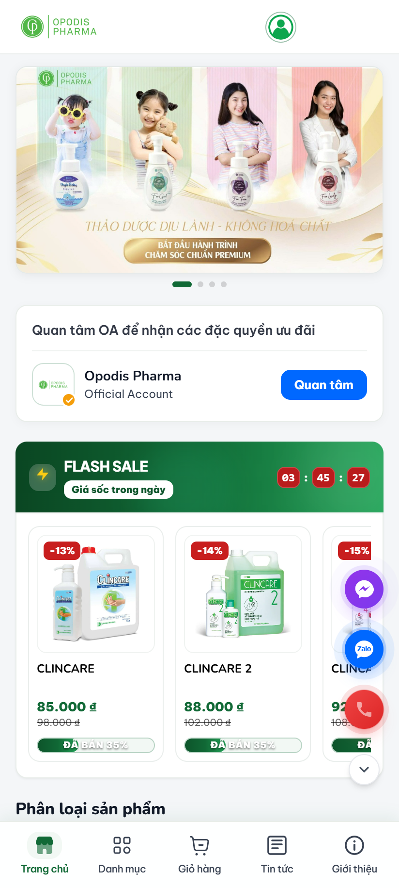
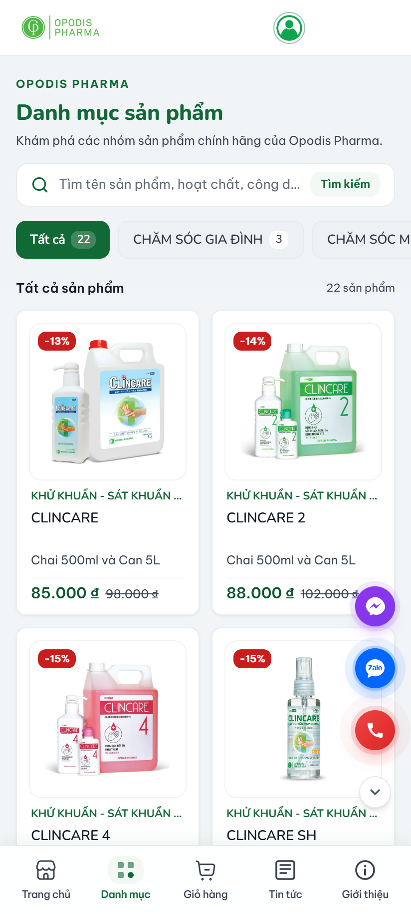
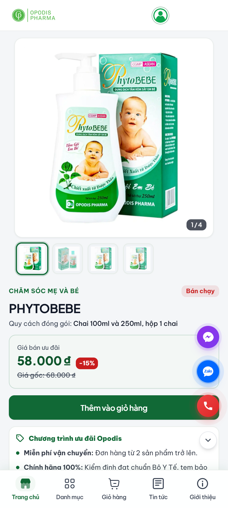
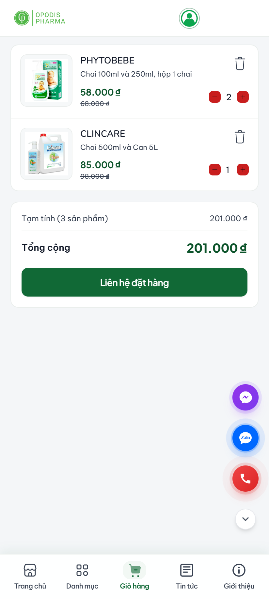
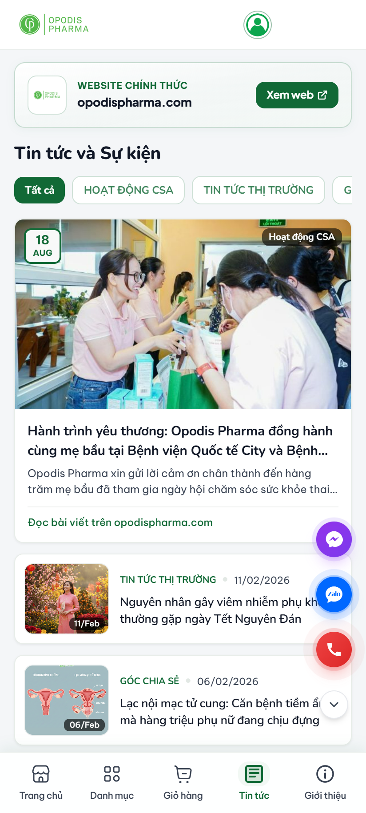
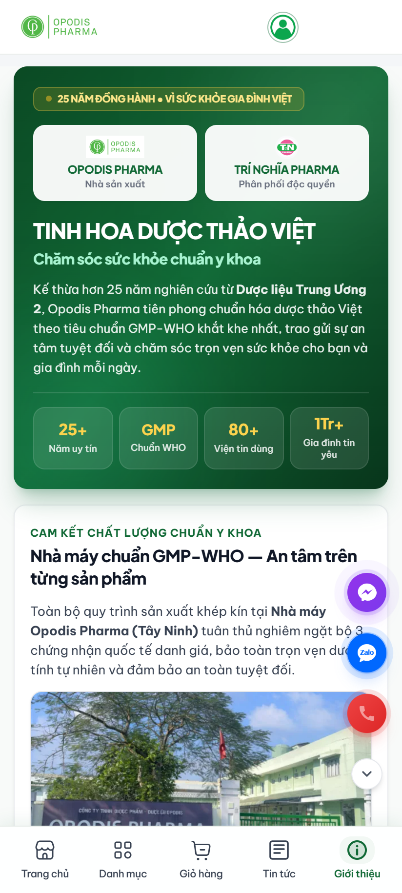
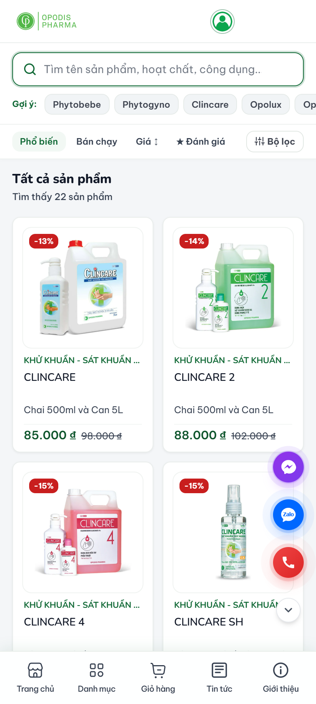

# 🌿 Trí Nghĩa Pharma - Opodis Pharma Zalo Mini App

> **Tinh hoa dược thảo Việt — Giải pháp chăm sóc sức khỏe gia đình chuẩn Y khoa**  
> Ứng dụng Zalo Mini App chính thức của **Công ty TNHH Dược phẩm - Dược liệu Trí Nghĩa** (Nhà phân phối độc quyền toàn quốc) và **Công ty TNHH Dược phẩm - Dược liệu Opodis** (Nhà sản xuất đạt chuẩn quốc tế GMP-WHO, CGMP-ASEAN, ISO 13485:2016).

---

<p align="center">
  
  
  
  
  
  
</p>

---

## 📱 1. Hình Ảnh Demo Trực Tiếp Dự Án (Full Màn Hình Các Tab)

> [!NOTE]
> Toàn bộ ảnh demo được chụp thực tế với tỉ lệ màn hình điện thoại di động chuẩn (20:9), hiển thị đầy đủ Header, nội dung và thanh điều hướng Bottom Navigation. Popup quảng cáo đã được tắt để quan sát trọn vẹn từng tính năng.

| 🏠 01. Trang Chủ (Home Screen) | 📑 02. Danh Mục Sản Phẩm (Catalog) | 🔍 03. Chi Tiết Sản Phẩm (Detail) |
| :---: | :---: | :---: |
|  |  |  |
| *Banner, Quan tâm OA, Flash Sale thời gian thực & Phân loại* | *Bộ lọc danh mục đa tầng, lưới 2 cột hiển thị 22 sản phẩm chuẩn Y tế* | *Bộ sưu tập ảnh đa góc, giá sale, cam kết & thông tin dược lý* |

| 🛒 04. Giỏ Hàng (Cart Screen) | 📰 05. Tin Tức & Sự Kiện (News) | 🏛️ 06. Giới Thiệu & Đối Tác (About) |
| :---: | :---: | :---: |
|  |  |  |
| *Quản lý số lượng, tính tổng tiền realtime & CTA đặt hàng* | *Bài viết tiêu điểm CSA, kiến thức y khoa với font Nunito mềm* | *Di sản 25+ năm, chứng nhận GMP-WHO & carousel 13 đối tác lớn* |

<p align="center">
  <b>🔎 07. Màn Hình Tìm Kiếm Sản Phẩm Thông Minh (Search)</b><br /><br />
  <br />
  <i>Tìm kiếm tức thì theo tên/công dụng, từ khóa gợi ý hot (Phytobebe, Phytogyno, Clincare...) & sắp xếp linh hoạt</i>
</p>

---

## 🚀 2. Giới Thiệu & Mục Tiêu Dự Án

Dự án **Trí Nghĩa Pharma Mini App** được thiết kế và triển khai trên nền tảng **Zalo Mini App**, nhằm kết nối trực tiếp **Công ty TNHH Dược phẩm - Dược liệu Trí Nghĩa** và **Opodis Pharma** tới hơn 75 triệu người dùng Zalo tại Việt Nam.

Ứng dụng cung cấp giải pháp tiếp cận sản phẩm dược phẩm, dược liệu, dung dịch sát khuẩn y tế và các dòng chăm sóc sức khỏe thảo dược chuẩn Y khoa một cách nhanh chóng, minh bạch về nguồn gốc và bảo đảm an toàn tuyệt đối.

### Các dòng sản phẩm chủ lực:
- 🌸 **OPODIS FAMILY PREMIUM**: Dòng dung dịch vệ sinh phụ nữ chuyên sâu Phytogyno (Lady, Mom, Teen, Girl) chiết xuất thảo dược thiên nhiên, cân bằng sinh lý.
- 👶 **CHĂM SÓC MẸ VÀ BÉ**: Sữa tắm rôm sẩy thảo dược Phytobebe, dầu tràm Emcare bảo vệ dịu nhẹ làn da bé sơ sinh.
- 👨‍👩‍👧‍👦 **CHĂM SÓC GIA ĐÌNH & NAM GIỚI**: Dung dịch vệ sinh nam Opolux khử mùi kháng khuẩn 24h, xịt họng thảo dược Opflu hỗ trợ hô hấp.
- 🏥 **SÁT KHUẨN Y TẾ CHUYÊN DỤNG**: Dung dịch sát khuẩn tay Clincare, Clincare 2, Clincare 4, cồn y tế Opodex 70 đạt chuẩn kiểm nghiệm phòng mổ bệnh viện.

---

## ✨ 3. Các Tính Năng Nổi Bật

### ⚡ Flash Sale & Săn Deal Realtime
- Khối Flash Sale với đồng hồ đếm ngược từng giây (`hh:mm:ss`) tạo tính cấp thiết mua sắm.
- Biểu tượng tia sét màu vàng rực rỡ (`#facc15`), nổi bật trên nền xanh dược liệu.
- Thanh tiến độ hiển thị tỷ lệ đã bán trực quan (`soldCount`), nhãn giảm giá phần trăm (`-13%`, `-14%`, `-15%`) cạnh giá gốc rõ ràng.

### 🔍 Bộ Lọc & Tìm Kiếm Đa Chiều
- Tìm kiếm tức thì theo tên thuốc, hoạt chất, quy cách đóng gói và công dụng.
- Phân nhóm danh mục động: *Tất cả (22), Chăm sóc gia đình (3), Mẹ & Bé (4), Khử khuẩn & Sát khuẩn (11), Opodis Family Premium (4)*.
- Hàng thẻ gợi ý từ khóa tìm kiếm nhanh (`Phytobebe`, `Phytogyno`, `Clincare`, `Opolux`).
- Bộ lọc sắp xếp: Phổ biến, Bán chạy, Giá tăng/giảm và Đánh giá.

### 🛒 Giỏ Hàng Persistent (Lưu Trữ Tự Động)
- Ứng dụng tích hợp `atomWithStorage` từ Jotai, tự động đồng bộ giỏ hàng vào `localStorage` của thiết bị.
- Dữ liệu giỏ hàng (sản phẩm, số lượng, giá tạm tính) được bảo toàn trọn vẹn khi người dùng chuyển trang hoặc mở lại ứng dụng.
- Nút CTA chuyển tiếp liên hệ đặt hàng nhanh chóng qua Zalo OA hoặc Hotline dược sĩ.

### 💬 Floating Contact Thông Minh (3 Trong 1)
- Cụm nút liên hệ nổi cố định tích hợp 3 kênh hỗ trợ trực tiếp:
  - **Zalo Official Account**: Mở trực tiếp hội thoại chat tư vấn chuyên sâu với Zalo OA Opodis Pharma.
  - **Hotline Y Tế**: Quay số gọi trực tiếp tới Dược sĩ tư vấn `(0283) 7582 741`.
  - **Facebook Messenger**: Kênh liên lạc hỗ trợ mạng xã hội.
- Nút bấm với hiệu ứng sóng tỏa nhẹ (`floating-pulse`), hỗ trợ thao tác thu gọn/mở rộng linh hoạt và tự động định vị thông minh để không che lấp nội dung chính hay thanh header.

### 🏛️ Băng Chuyền Đối Tác Động & Di Sản 25 Năm
- **Carousel đối tác chuyển động ngang liên tục (Continuous Marquee 60fps)**: Trưng bày logo 13 đối tác bệnh viện đầu ngành và chuỗi nhà thuốc lớn: *BV Từ Dũ, BV Chợ Rẫy, Quân Y 175, Nhi Đồng 1, FPT Long Châu, Pharmacity, VNVC, BV Tâm Anh, HCDC, BV Phụ sản Quốc tế Sài Gòn, BV Gia Định, BV Bình Dân, BV Bệnh Nhiệt Đới*.
- Giới thiệu hình ảnh nhà máy sản xuất Opodis Pharma đạt chuẩn **GMP-WHO, CGMP-ASEAN, ISO 13485:2016** tại KCN Linh Trung III, Trảng Bàng, Tây Ninh.

### 📢 Popup Khuyến Mãi Tiếp Thị Thông Minh
- Banner quảng cáo sự kiện (*Sale 09.09 Deal Đỉnh - Quà Xịn*).
- Lưu trạng thái đóng vào `sessionStorage`, tự động ẩn sau khi người dùng bấm tắt (`X` hoặc `Bỏ qua ưu đãi`), mang lại trải nghiệm êm ái, không gây gián đoạn thao tác.

---

## 🎨 4. Hệ Thống Thiết Kế & Nhận Diện Thương Hiệu

### 🌿 Bảng Màu Y Tế (Medical Palette)

```scss
--primary: #116936;       /* Xanh lá thảo dược đậm chuẩn Y Dược */
--primary-dark: #0d542b;  /* Sắc độ trầm cho tiêu đề, nhấn nút bấm */
--primary-soft: #f2f8f4;  /* Xanh ngọc nhạt làm nền thẻ & highlight */
--surface: #ffffff;       /* Trắng tinh khiết cho thẻ card & modal */
--background: #f4f6f8;    /* Nền xám y tế dịu mắt, tăng độ tương phản */
--lightning: #facc15;     /* Vàng tia chớp Flash Sale rực rỡ */
```

### 🔤 Hệ Thống Typography 3 Lớp Chuyên Nghiệp
1. **Font nội dung chủ đạo (`sans`)**: **`Be Vietnam Pro`** (Google Fonts)  
   *Tối ưu 100% tiếng Việt có dấu, nét chữ sắc nét trên cả Webview iOS và Android, triệt tiêu hoàn toàn lỗi lệch dấu tiếng Việt.*
2. **Font mềm mại cho danh mục & tiêu đề (`heading`, `soft`)**: **`Nunito`**  
   *Đầu nét bo tròn tinh tế (`rounded terminals`), tạo cảm giác thân thiện, dịu mát, gần gũi với phong cách thảo dược thiên nhiên và mẹ & bé.*
3. **Font thương hiệu & số liệu (`brand`, `stat-number`)**: **`Plus Jakarta Sans`**  
   *Hiện đại, chuẩn xác cho logo thương hiệu và các chỉ số di sản (`25+`, `80+`, `1Tr+`).*

### 📐 Hệ Thống Border-Radius Chuẩn Y Khoa
Loại bỏ hoàn toàn các lớp bo góc quá đà (casual rounded 24px, viên thuốc 9999px), thay thế bằng hệ thống tinh tế, chắc chắn:
- **Hero Banner & Ảnh chi tiết**: `14px` (`rounded-2xl`)
- **Thẻ Card sản phẩm & Section**: `10px - 12px` (`rounded-xl` / `rounded-card`)
- **Nút bấm CTA & Tabs danh mục**: `8px` (`rounded-lg`)
- **Ô nhập liệu tìm kiếm**: `12px` (`rounded-xl`)
- **Huy hiệu, Tag, Counter**: `4px - 6px` (`rounded-md`)
- **Nút tròn liên hệ nổi (FAB)**: `rounded-full`

---

## ⚡ 5. Tối Ưu Hóa Tài Nguyên & Hiệu Suất (Performance)

Nền tảng Zalo Mini App áp dụng giới hạn kích thước gói ứng dụng khắt khe (**tối đa 6 MiB** cho tài nguyên bundle). Dự án đã đạt chuẩn tối ưu xuất sắc:

| Hạng mục | Ban đầu (Raw) | Sau tối ưu (Production) | Mức độ cải thiện |
| :--- | :---: | :---: | :---: |
| **Định dạng ảnh** | `.png` / `.jpg` nguyên bản | **`.webp` (q=82, lossy)** | Tối ưu 94% dung lượng |
| **Tổng số lượng ảnh app** | 244 ảnh sản phẩm | **88 ảnh (22 main + 66 gallery)** | Chọn lọc 3 ảnh phụ/sản phẩm |
| **Tổng dung lượng ảnh** | 46.43 MiB | **2.80 MiB** | **Đạt chuẩn `<= 6 MiB` (PASS)** |
| **Ảnh lớn nhất** | 2.73 MiB | **0.09 MiB (90 KB)** | Tải nhanh tức thì dưới mạng 3G/4G |

### Pipeline Tối Ưu Tự Động (Scripts):
- `npm run sync:opodis`: Đồng bộ dữ liệu 22 sản phẩm chuẩn từ file cấu hình nguồn.
- `npm run optimize:opodis`: Tự động nén và chuyển đổi kho ảnh sang định dạng WebP.
- `npm run validate:opodis`: Script kiểm định tự động 100% tính toàn vẹn của dữ liệu và hình ảnh trước khi build/deploy.

---

## 📂 6. Cấu Trúc Thư Mục Dự Án

```text
tri-nghia-pharma-app/
├── docs/                      # Tài liệu & hình ảnh demo dự án
│   └── demo/                  # Ảnh chụp màn hình full di động các tab
├── scripts/                   # Bộ công cụ tự động hóa
│   ├── sync-opodis-products.mjs     # Đồng bộ dữ liệu sản phẩm
│   ├── optimize-opodis-images.mjs   # Nén và tối ưu ảnh WebP
│   ├── validate-opodis-products.mjs # Kiểm định chất lượng tài nguyên
│   └── capture-demo-screens.py      # Script chụp ảnh demo tự động
├── src/
│   ├── app.ts                 # Điểm khởi tạo ứng dụng Zalo Mini App
│   ├── components/            # Thư viện UI Components dùng chung
│   │   ├── carousel.tsx             # Slider banner trang chủ
│   │   ├── partner-carousel.tsx     # Băng chuyền đối tác động 60fps
│   │   ├── flash-sale.tsx           # Khối Flash Sale đếm ngược realtime
│   │   ├── floating-contact.tsx     # Nút liên hệ nổi 3 trong 1 (Zalo/Hotline/FB)
│   │   ├── follow-oa-card.tsx       # Widget quan tâm Zalo Official Account
│   │   ├── product-item.tsx         # Thẻ hiển thị sản phẩm chuẩn Y tế
│   │   ├── product-grid.tsx         # Lưới bố cục sản phẩm
│   │   ├── promo-popup.tsx          # Modal quảng cáo khuyến mãi thông minh
│   │   ├── header.tsx & footer.tsx  # Thanh tiêu đề & thanh điều hướng chính
│   │   └── search-bar.tsx           # Thanh tìm kiếm nhanh
│   ├── css/
│   │   ├── app.scss                 # Biến CSS, tokens và custom animations
│   │   └── tailwind.scss            # Cấu hình Tailwind CSS 3.4
│   ├── data/
│   │   ├── opodis-products.json     # Dữ liệu 22 sản phẩm Opodis chuẩn Y khoa
│   │   └── news.json                # Dữ liệu tin tức, hoạt động CSA y tế
│   ├── domain/                # Kiểu dữ liệu nghiệp vụ (Product, Cart, Category)
│   ├── pages/                 # Các màn hình chính (Tabs)
│   │   ├── home/                    # Trang chủ (Banner, OA, Flash Sale, Sản phẩm)
│   │   ├── catalog/                 # Danh mục & Chi tiết sản phẩm
│   │   ├── cart/                    # Giỏ hàng & Đặt hàng
│   │   ├── news/                    # Tin tức, sự kiện & bài viết y khoa
│   │   ├── about/                   # Giới thiệu doanh nghiệp, nhà máy & đối tác
│   │   └── search/                  # Tìm kiếm sản phẩm
│   ├── static/                # Tài nguyên tĩnh
│   │   ├── banners/                 # Banner truyền thông chất lượng cao
│   │   ├── partners/                # 13 logo bệnh viện & đối tác chuỗi nhà thuốc
│   │   ├── ecommerce/               # Logo các sàn TMĐT (Shopee, Lazada, TikTok)
│   │   └── products-app/            # 88 ảnh WebP thành phẩm phục vụ ứng dụng
│   ├── state.ts               # Quản lý state toàn cục với Jotai & Storage
│   └── router.tsx             # Điều hướng React Router
├── app-config.json            # Cấu hình Zalo Mini App (Title, Header, StatusBar)
├── package.json               # Danh sách thư viện và scripts
├── tailwind.config.js         # Token bảng màu, typography, radius
├── vite.config.mts            # Cấu hình Vite & zmp-vite-plugin
└── README.md                  # Tài liệu hướng dẫn dự án chi tiết
```

---

## 🛠️ 7. Hướng Dẫn Cài Đặt & Phát Triển

### Yêu cầu môi trường:
- **Node.js**: Phiên bản `18.x` hoặc `20.x` (khuyến nghị).
- **Trình quản lý gói**: `npm` hoặc `yarn`.
- **Zalo Mini App Studio** hoặc công cụ dòng lệnh `zmp-cli`.

### Các bước cài đặt:

```bash
# 1. Clone mã nguồn dự án
git clone https://github.com/Peo051/Tri-Nghia-Pharma.git
cd Tri-Nghia-Pharma/tri-nghia-pharma-app

# 2. Cài đặt các gói phụ thuộc
npm install

# 3. Khởi chạy máy chủ phát triển (Development Server)
npm start
# hoặc chạy trực tiếp bằng Vite:
npx vite . --port 3000
```

### Các lệnh tiện ích:

```bash
# Kiểm tra tính hợp lệ của toàn bộ kho sản phẩm và dung lượng ảnh
npm run validate:opodis

# Tự động nén và tối ưu hóa toàn bộ ảnh sang WebP
npm run optimize:opodis

# Biên dịch CSS Tailwind
npm run build:css

# Đóng gói và triển khai ứng dụng lên Zalo Mini App
npm run deploy
```

---

## 🏢 8. Thông Tin Doanh Nghiệp & Liên Hệ

<table width="100%">
  <tr>
    <td width="50%" valign="top">
      <h4>🏢 Đơn Vị Phân Phối Độc Quyền Toàn Quốc</h4>
      <p><b>CÔNG TY TNHH DƯỢC PHẨM - DƯỢC LIỆU TRÍ NGHĨA</b></p>
      <ul>
        <li><b>Địa chỉ:</b> Số 19, Đường số 4, KDC Bình Hưng, Xã Bình Hưng, Huyện Bình Chánh, TP. Hồ Chí Minh</li>
        <li><b>Hotline tư vấn Dược sĩ:</b> <a href="tel:02837582741">(0283) 7582 741</a></li>
        <li><b>Email:</b> info@tringhiapharma.com</li>
      </ul>
    </td>
    <td width="50%" valign="top">
      <h4>🏭 Nhà Sản Xuất Chuẩn Quốc Tế</h4>
      <p><b>CÔNG TY TNHH DƯỢC PHẨM - DƯỢC LIỆU OPODIS</b></p>
      <ul>
        <li><b>Nhà máy sản xuất:</b> Lô 27A, Đường số 8, KCN Linh Trung III, Phường An Tịnh, Thị xã Trảng Bàng, Tây Ninh</li>
        <li><b>Tiêu chuẩn:</b> GMP-WHO, CGMP-ASEAN, ISO 13485:2016</li>
        <li><b>Website chính thức:</b> <a href="https://opodispharma.com/" target="_blank">opodispharma.com</a></li>
      </ul>
    </td>
  </tr>
</table>

---

<p align="center">
  <b>© 2026 TRÍ NGHĨA PHARMA & OPODIS PHARMA. ALL RIGHTS RESERVED.</b><br />
  <i>Phát triển bởi đội ngũ kỹ thuật Zalo Mini App Opodis.</i>
</p>
