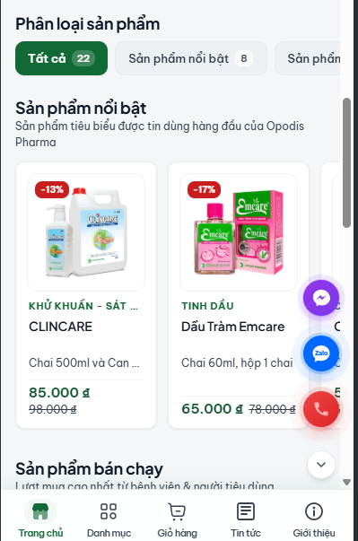
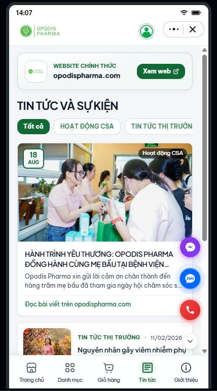
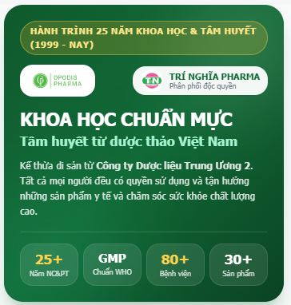
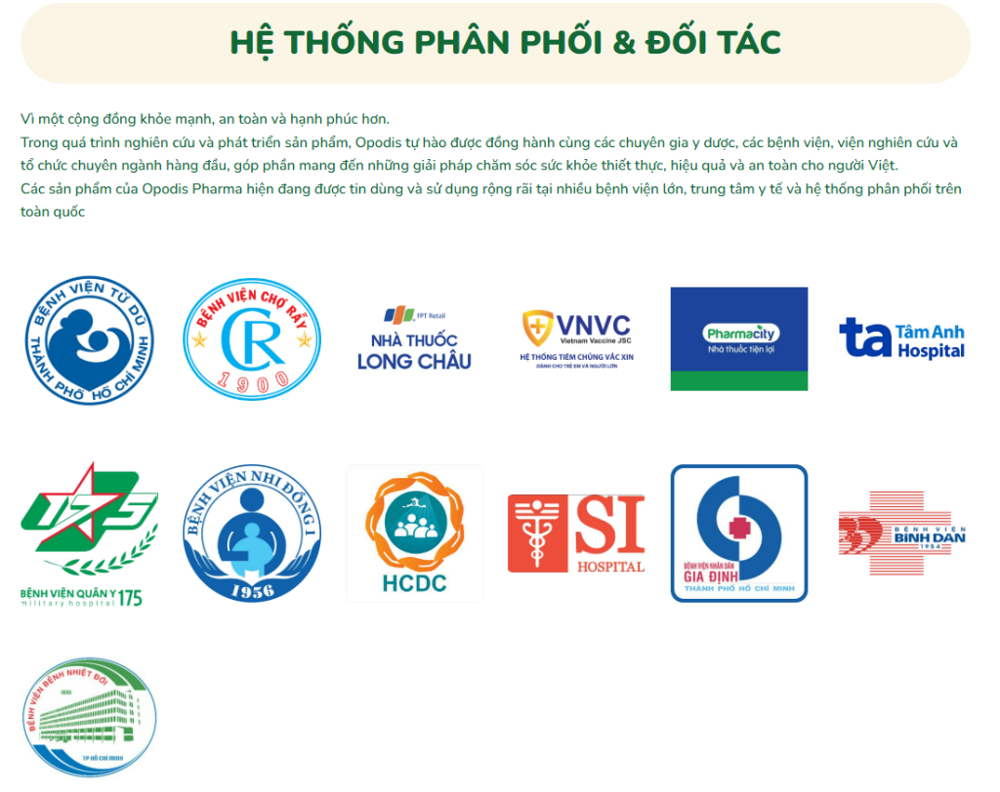

# 🌿 Trí Nghĩa Pharma - Opodis Pharma Zalo Mini App

> **Tinh hoa dược thảo Việt — Giải pháp chăm sóc sức khỏe gia đình chuẩn Y khoa**  
> Ứng dụng Zalo Mini App chính thức của **Công ty TNHH Dược phẩm - Dược liệu Trí Nghĩa** (Nhà phân phối độc quyền toàn quốc) và **Công ty TNHH Dược phẩm - Dược liệu Opodis** (Nhà sản xuất đạt chuẩn quốc tế GMP-WHO).

---

<p align="center">
  
  
  
  
  
  
</p>

---

## 📱 1. Hình Ảnh Demo Trực Tiếp Dự Án

| 🏠 Trang Chủ & Flash Sale | 📰 Tin Tức & Sự Kiện |
| :---: | :---: |
|  |  |
| *Flash Sale giá sốc, bộ lọc danh mục và khối sản phẩm nổi bật* | *Tin tức hoạt động cộng đồng (CSA), cẩm nang sức khỏe y khoa* |

| 🌟 Di Sản 25 Năm & Nhà Máy GMP-WHO | 🏥 Hệ Thống 80+ Bệnh Viện & Đối Tác |
| :---: | :---: |
|  |  |
| *25+ Năm uy tín, chuẩn GMP-WHO, 80+ bệnh viện và 1 triệu+ gia đình tin dùng* | *Hiện diện tại Từ Dũ, Chợ Rẫy, FPT Long Châu, Pharmacity, VNVC...* |

---

## 🚀 2. Giới Thiệu & Mục Tiêu Dự Án

Dự án **Trí Nghĩa Pharma Mini App** được phát triển trên nền tảng **Zalo Mini App**, nhằm mang đến trải nghiệm tiếp cận sản phẩm dược phẩm, dược liệu và sản phẩm chăm sóc sức khỏe chính hãng một cách nhanh chóng, minh bạch và an toàn nhất cho hơn 75 triệu người dùng Zalo.

### Các dòng sản phẩm chủ đạo:
- 🌸 **OPODIS FAMILY PREMIUM**: Dung dịch vệ sinh phụ nữ chuyên sâu Phytogyno (Lady, Mom, Teen, Girl) thảo dược lành tính, cân bằng pH.
- 👶 **CHĂM SÓC MẸ VÀ BÉ**: Sữa tắm rôm sẩy thảo dược Phytobebe, Emcare bảo vệ làn da bé.
- 👨‍👩‍👧‍👦 **CHĂM SÓC GIA ĐÌNH & NAM GIỚI**: Dung dịch vệ sinh nam Opolux khử mùi 24h, xịt họng thảo dược Opflu bảo vệ đường hô hấp.
- 🏥 **SÁT KHUẨN Y TẾ CHUYÊN DỤNG**: Dung dịch sát khuẩn tay Clincare, cồn y tế Opodex 70 chuẩn phòng mổ bệnh viện.

---

## ✨ 3. Các Tính Năng Nổi Bật

### ⚡ Flash Sale & Săn Deal Realtime
- Khối Flash Sale với đồng hồ đếm ngược từng giây (`hh:mm:ss`).
- Thanh tiến độ hiển thị trực quan tỷ lệ hàng đã bán (`soldCount`).
- Nhãn giảm giá phần trăm nổi bật (`-13%`, `-17%`) và giá sale cạnh giá gốc rõ ràng.

### 🔍 Bộ Lọc & Tìm Kiếm Thông Minh
- Tìm kiếm tức thì theo tên thuốc, hoạt chất, quy cách, công dụng.
- Lọc sản phẩm theo danh mục động (Tất cả, Sản phẩm nổi bật, Bán chạy, Vệ sinh & Chăm sóc, Sát khuẩn).
- **Thanh trượt giá kéo linh hoạt (Price Range Slider)** từ `0đ` đến `1.000.000đ` cho phép khách hàng chủ động chọn mức giá mong muốn.
- Gợi ý từ khóa tìm kiếm nhanh (`Phytogyno`, `Phytobebe`, `Clincare`, `Dầu tràm`, `Opflu`).

### 💬 Floating Contact Thông Minh (3 Trong 1)
- Cụm nút liên hệ nổi tích hợp đầy đủ 3 kênh hỗ trợ nhanh:
  - **Zalo OA**: Mở trực tiếp hộp thoại chat tư vấn với Zalo Official Account chính thức.
  - **Hotline Y Tế**: Quay số gọi trực tiếp đến Dược sĩ tư vấn `(0283) 7582 741`.
  - **Facebook Messenger**: Liên kết fanpage hỗ trợ khách hàng.
- Hiệu ứng sóng lan tỏa (`floating-pulse`), tự động thu gọn/mở rộng mượt mà và không che khuất thanh header hoặc chân trang.

### 🏛️ Bảo Chứng Niềm Tin & Băng Chuyền Đối Tác Động
- **Carousel động chạy ngang liên tục 60fps** hiển thị 13 đối tác chiến lược: Bệnh viện Từ Dũ, Bệnh viện Chợ Rẫy, Quân Y 175, Nhi Đồng 1, FPT Long Châu, Pharmacity, VNVC, Tâm Anh Hospital, HCDC, SI Hospital, Gia Định, Bình Dân, Bệnh Nhiệt Đới.
- Giới thiệu thực tế nhà máy sản xuất Opodis Pharma đạt chuẩn **GMP-WHO, CGMP-ASEAN, ISO 13485:2016** tại KCN Linh Trung III, Trảng Bàng, Tây Ninh.

### 🛒 Giỏ Hàng & Tích Hợp Đặt Hàng
- Quản lý giỏ hàng cục bộ tức thời (`state.ts` với Jotai).
- Điều chỉnh số lượng sản phẩm, tính tổng tiền tự động.
- Nút CTA chuyển tiếp liên hệ đặt hàng nhanh qua Zalo OA hoặc Hotline dược sĩ.

---

## 🎨 4. Hệ Thống Thiết Kế & Nhận Diện Thương Hiệu

### 🌿 Bảng Màu Y Tế (Medical Palette)
- **Màu chủ đạo (`Primary`)**: `#116936` (Xanh lá thảo dược đậm chuẩn ngành Dược)
- **Màu nhấn (`Primary Dark`)**: `#0d542b`
- **Màu nền phụ (`Primary Soft`)**: `#f2f8f4`
- **Màu nền ứng dụng (`Background`)**: `#f4f6f8`

### 🔤 Hệ Thống Typography Chuẩn Tiếng Việt
Dự án được cấu hình hệ thống font chữ 3 lớp chuyên nghiệp:
1. **Font nội dung chủ đạo (`sans`)**: **`Be Vietnam Pro`** (Google Fonts)  
   *Tối ưu 100% tiếng Việt có dấu, bộ ký tự hoàn chỉnh, sắc nét tuyệt đối trên cả Webview iOS và Android, triệt tiêu mọi lỗi rơi dấu.*
2. **Font mềm mại cho danh mục & tiêu đề (`heading`, `soft`)**: **`Nunito`**  
   *Đầu nét bo tròn tinh tế (`rounded terminals`), mang đến cảm giác dịu êm, mềm mại, ấm áp và thân thiện, chuẩn phong cách Dược mỹ phẩm & Gia đình.*
3. **Font điểm nhấn thương hiệu & số liệu (`brand`, `stat-number`)**: **`Plus Jakarta Sans`**  
   *Hiện đại, khỏe khoắn cho logo, huy hiệu và các chỉ số giá trị (`25+`, `80+`, `1Tr+`).*

### 📐 Hệ Thống Border-Radius Chuẩn Y Khoa
Loại bỏ hoàn toàn các lớp cong quá đà kiểu casual app (`rounded-3xl` 24px, `rounded-pill` 9999px), thay thế bằng hệ thống tinh tế:
- **Hero Banner & Ảnh chi tiết**: `14px` (`rounded-2xl`)
- **Khung Card & Section**: `10px - 12px` (`rounded-xl` / `rounded-card`)
- **Nút CTA & Tabs danh mục**: `8px` (`rounded-lg`)
- **Ô nhập liệu tìm kiếm**: `12px` (`rounded-xl`)
- **Huy hiệu, Tag, Counter**: `4px - 6px` (`rounded-md`)
- **Nút tròn FAB liên hệ**: `rounded-full`

---

## 📂 5. Cấu Trúc Mã Nguồn Dự Án

```text
tri-nghia-pharma-app/
├── docs/                      # Tài liệu & hình ảnh minh họa demo
│   ├── demo/                  # Ảnh chụp màn hình thực tế của ứng dụng
│   │   ├── home-screen.png    # Ảnh demo trang chủ
│   │   ├── news-screen.png    # Ảnh demo trang tin tức
│   │   ├── about-hero.png     # Ảnh demo banner giới thiệu
│   │   └── partners-network.png # Ảnh demo đối tác bệnh viện
│   └── ...
├── scripts/                   # Công cụ tối ưu hóa dữ liệu tự động
│   ├── sync-opodis-products.mjs     # Đồng bộ dữ liệu 22 sản phẩm Opodis
│   ├── optimize-opodis-images.mjs   # Nén & chuyển đổi ảnh sản phẩm sang WebP
│   └── validate-opodis-products.mjs # Kiểm tra tính toàn vẹn và dung lượng build
├── src/
│   ├── components/            # Các thành phần giao diện tái sử dụng
│   │   ├── carousel.tsx       # Băng chuyền banner
│   │   ├── flash-sale.tsx     # Khối Flash Sale đếm ngược
│   │   ├── floating-contact.tsx # Cụm liên hệ nổi Zalo / Phone / Messenger
│   │   ├── follow-oa-card.tsx # Widget quan tâm Zalo Official Account
│   │   ├── partner-carousel.tsx # Carousel động 13 logo bệnh viện & nhà thuốc
│   │   ├── product-item.tsx   # Card hiển thị sản phẩm chuẩn Y tế
│   │   ├── search-bar.tsx     # Thanh tìm kiếm nhanh
│   │   └── ...
│   ├── css/
│   │   ├── app.scss           # Global stylesheet & reset font
│   │   └── tailwind.scss      # Biến CSS :root, tokens và utility classes
│   ├── domain/                # Định nghĩa kiểu dữ liệu (Product, Category...)
│   ├── mock/                  # Dữ liệu sản phẩm và tin tức mẫu
│   │   └── products.ts        # Danh mục 22 sản phẩm Opodis Pharma chính thức
│   ├── pages/                 # Các trang màn hình chính
│   │   ├── home/              # Trang chủ (Banner, Flash Sale, Phân loại, List)
│   │   ├── catalog/           # Danh mục sản phẩm & chi tiết sản phẩm
│   │   ├── cart/              # Giỏ hàng & đặt hàng
│   │   ├── news/              # Trang tin tức, sự kiện & cẩm nang sức khỏe
│   │   ├── about/             # Trang giới thiệu thương hiệu, nhà máy & đối tác
│   │   └── search/            # Trang tìm kiếm & bộ lọc giá
│   ├── static/                # Tài nguyên hình ảnh production (WebP <= 2.8 MiB)
│   ├── app.ts                 # Điểm khởi tạo ứng dụng React
│   ├── router.tsx             # Định tuyến SPA (React Router v6)
│   └── state.ts               # Quản lý trạng thái giỏ hàng toàn cục (Jotai)
├── app-config.json            # Cấu hình Zalo Mini App (Header, Safe Area, OA ID)
├── package.json               # Khai báo thư viện & kịch bản lệnh
├── tailwind.config.js         # Cấu hình Tailwind (Colors, FontFamily, Radius)
└── vite.config.mts            # Cấu hình đóng gói Vite 5 & ZMP Plugin
```

---

## 🛠️ 6. Hướng Dẫn Cài Đặt & Chạy Dự Án

### Yêu cầu môi trường:
- **Node.js**: Phiên bản 18.x hoặc 20.x trở lên
- **Trình quản lý gói**: `npm` (đi kèm Node.js)
- **Công cụ khuyến nghị**: Visual Studio Code với [Zalo Mini App Extension](https://mini.zalo.me/docs/dev-tools)

### 1. Cài đặt thư viện dependencies:
```bash
npm install
```

### 2. Kiểm tra tính hợp lệ của dữ liệu sản phẩm:
```bash
npm run validate:opodis
```
> Kịch bản sẽ quét toàn bộ 22 sản phẩm, kiểm tra ảnh đại diện, thư viện ảnh và đảm bảo tổng dung lượng production luôn `<= 6 MiB` (hiện tại đạt mức tối ưu **2.80 MiB**).

### 3. Khởi chạy môi trường phát triển (Dev Server):
```bash
# Cách 1: Sử dụng Zalo Mini App Extension trên VS Code (Khuyên dùng)
# Mở bảng điều khiển Zalo Mini App > Nhấn "Start"

# Cách 2: Sử dụng ZMP CLI
zmp start
```
Ứng dụng sẽ chạy tại `http://localhost:3000` và cung cấp mã QR để quét xem trước trên Zalo di động.

### 4. Triển khai (Deploy lên Zalo Mini App Center):
```bash
zmp login
zmp deploy
```

---

## 🏢 7. Đơn Vị Phát Triển & Liên Hệ Pháp Lý

- **Đơn vị sản xuất**:  
  **CÔNG TY TNHH DƯỢC PHẨM - DƯỢC LIỆU OPODIS**  
  *Nhà máy đạt chuẩn GMP-WHO, CGMP-ASEAN, ISO 13485:2016*  
  Địa chỉ: Lô 78, Khu CX & CN Linh Trung III, Phường An Tịnh, Thị xã Trảng Bàng, Tây Ninh, Việt Nam.  
  Điện thoại: (0276) 3898 656

- **Đơn vị phân phối độc quyền toàn quốc**:  
  **CÔNG TY TNHH DƯỢC PHẨM - DƯỢC LIỆU TRÍ NGHĨA**  
  Địa chỉ: Số 15 đường số 4, KDC Intresco, Xã Bình Hưng, Huyện Bình Chánh, TP. Hồ Chí Minh.  
  Hotline Dược sĩ tư vấn 24/7: **(0283) 7582 741** — **(0283) 7582 742**

- **Hệ thống trực tuyến chính hãng**:
  - Website: [https://opodispharma.com](https://opodispharma.com)
  - Zalo Official Account: [Opodis Pharma OA](https://zalo.me/4318657068771012646)
  - Shopee Mall: [Opodis Pharma Official](https://shopee.vn/opodispharma)
  - Lazada Mall: [Opodis Pharma LazMall](https://www.lazada.vn/shop/mn7k3oup/)
  - TikTok Shop: [@opodis.pharma](https://www.tiktok.com/@opodis.pharma)

---

<p align="center">
  <i>Phát triển với sự tận tâm vì sức khỏe cộng đồng người Việt © 2026 Opodis Pharma & Trí Nghĩa Pharma.</i>
</p>
